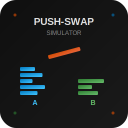

# push-swap-simulator
A pure javascript web simulator for the push-swap problem

## What is Push-Swap Simulator?

Push-swap-simulator is a pure JavaScript web application that provides interactive visualization and debugging tools for the push-swap algorithmic problem. The push-swap problem is a sorting challenge where you must sort a stack of integers (stack A) using only two stacks and a limited set of operations. The goal is to achieve a sorted sequence in stack A with stack B empty, using the minimum number of operations.
 

This simulator allows users to:
- Visualize stack states and operations in real-time
- Debug move sequences by stepping through them
- Compare two different solutions side-by-side
- Optimize by detecting where sequences converge and merging optimal segments

It is publicly available at https://fathzer.github.io/push-swap-simulator/

## The Push-Swap Problem Domain

The push-swap problem operates on two LIFO stacks (A and B) with 11 permitted operations:

| Operation | Description |
|-----------|-------------|
| `sa`, `sb`, `ss` | Swap top two elements of stack A, B, or both |
| `pa`, `pb` | Push top element from B to A, or A to B |
| `ra`, `rb`, `rr` | Rotate stack A, B, or both (shift up) |
| `rra`, `rrb`, `rrr` | Reverse rotate stack A, B, or both (shift down) |

The initial state has unsorted integers in stack A and an empty stack B. The goal state has sorted integers in stack A (smallest at top) and empty stack B.

## Key Features

### Single Simulation Mode

- Interactive stack visualization with color-coded elements showing relative values
- Infinite scroll for stacks with many elements (easier navigation to see top and bottom elements simultaneously)
- Move list editing with three modes: truncate, insert, and overwrite
- Manual operation execution via button controls
- Automatic playback with adjustable speed (AnimationRunner)
- Move navigation with step-forward/backward controls
- Clipboard integration for copying/pasting move sequences
- State persistence via localStorage for session recovery

### Comparison Mode
- Dual simulators running side-by-side with independent move sequences
- Convergence detection identifying where two solutions reach identical states
- Difference highlighting showing divergent move segments with color coding:
  - Orange: Different but same length
  - Green: Simulator 1 is better (fewer moves)
  - Red: Simulator 2 is better (fewer moves)
- Synchronized navigation across both simulators
- Move merging to combine optimal segments from both solutions
- Additional capabilities:
  - Random number generation for test cases
  - Success detection highlighting when sorting is complete
  - Edit modes for different insertion behaviors
  - Visual feedback system for user actions

## Common User Journeys

### Single Solution Testing

Enter numbers → Apply → Execute moves manually or paste sequence → Review visualization

### Solution Comparison

Enter numbers → Apply → Enable compare mode → Paste sequence A in sim 1 → Paste sequence B in sim 2 → Find differences → Review highlighted segments

### Solution Optimization:

Load two solutions → Find next diff → Analyze which segment is better → Merge better segment → Continue finding diffs → Export optimized solution

## Development Setup

Please refer to the  documentation for development setup instructions.

Please note that this documentation is AI generated and may contain errors: For instance, in the "Quick start" chapter of the "Overview" page, the proposal "*Open www/index.html directly in a web browser*" will not work due to modern browser CORS policy. You'll have to launch a web server.

Feel free to ask if something is not clear or post an issue about errors found in this documention.
